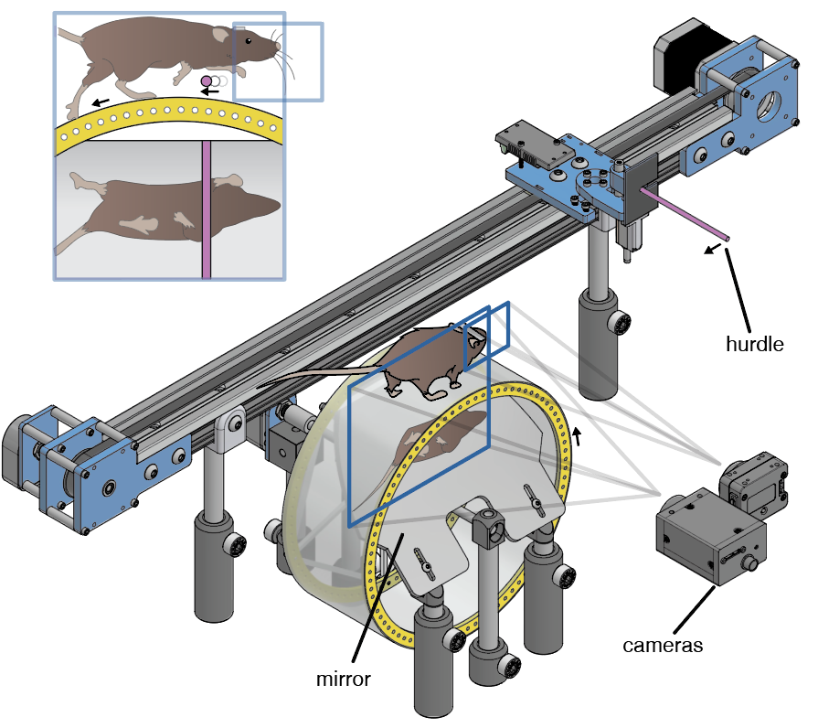

# how does the brain coordinate complex behavior?

For my PhD research (in the lab of [Nate Sawtell](https://zuckermaninstitute.columbia.edu/nathaniel-sawtell-phd)) I developed a closed loop system in which mice run on top of a wheel and leap over motorized hurdles. I designed a custom linear motion system along with microcontroller software that moves hurdles towards mice at the same speed that they are running, simulating what it is like to jump over stationary objects. Using [an open source motion tracking system](https://hackaday.io/project/160744-kinemouse-wheel) I designed we can relate 3D movements to the activity of neurons that control these movements.

I found that hurdling in mice involves a rapid sensorimotor decision that appears to be independent of primary motor and sensory cortex (manuscript in preparation). I am now collaborating with [Qianyun Zhang](https://github.com/RynzzZ) to understand how neural activity in the cerebellum relates and contributes to this behavior.

# how to...

#### analyze a single session
Analyzing a session requires running four neural networks (run tracking, run contact, whisker tracking, whisker contact), and several post-processing steps to get data ready for analysis. `analyzeSession(session)` does all of this. Note that:
- you can re-analyze a session *without* re-running certain neural networks by setting any of the following optional arguments to false: `rerunRunNetwork, rerunFaceNetwork, rerunWiskContactNetwork, rerunPawContactNetwork`.
- deepposekit can analyze a run OR whisker video using the `dpkAnalysis()` wrapper
- `dpkanalysis()` can also run the implementation of deeplabcut within the deepposekit framework by specifying a deeplabcut model
- the old version of the deeplabcut analysis (for run tracking only) can be run using the `dlcAnalysis(session) `wrapper

#### finish your PhD
tbd

# what is in...

#### a session folder
Immediately after recording each session will contain:

file | description
--- | ---
session.smr + session.s2rx | Spike2 recording
run.mat | matlab export of Spike2 data
run.csv | metadata for run camera
wisk.csv | metadata for whisker camera
webCam.csv | metadata for webcam
run.mp4 | run video (top and bottom views concatenated)
runWisk.mp4 | whisker video
webCam.avi | webcam video
trialInfo.csv | trial metadata (e.g. obstacle height) exported from Bonsai
trackedFeaturesRaw_metadata.mat + trackedFeaturesRaw_wisk_metadata.mat | contains metadata about which neural network analyses were used for the run and whisker cameras // used to determine confidence threshold for tracking, which should be lower for new deepposekit analyses relative to old deeplabcut analyses // these files are not currently in old sessions, which are assumed to be old if these files do not exist
alignmentFrames.csv | (optional) if getFrameTimes alignment breaks for a session, include this .csv file that encodes one pair of manually identified ttlNumber and frameNumber (for both run run *and* wisk cams) that are known to correspond to the same frame (see session 191009_003 for an example)

`analyzeSession(session)` will create the following additional files:

file | description
--- | ---
trackedFeaturesRaw.csv | tracking for run camera
trackedFeaturesRaw_wisk.csv | tracking for whisker camera
runAnalyzed.mat | tons of useful information, e.g. frame time stamps, contact times, obstacle times, etc.
whiskerAnalyzed.csv | whisker contact analysis results
pawAnalyzed.csv | paw contact analysis results

Sessions may also include:

file | description
--- | ---
kinData.mat | "trial-ized" struct, with each row containing many metrics for a trial
ephys_* folder | contains probe recordings
neuralData.mat | processed neural data
cellData.csv | spreadsheet containing information about sorted units
